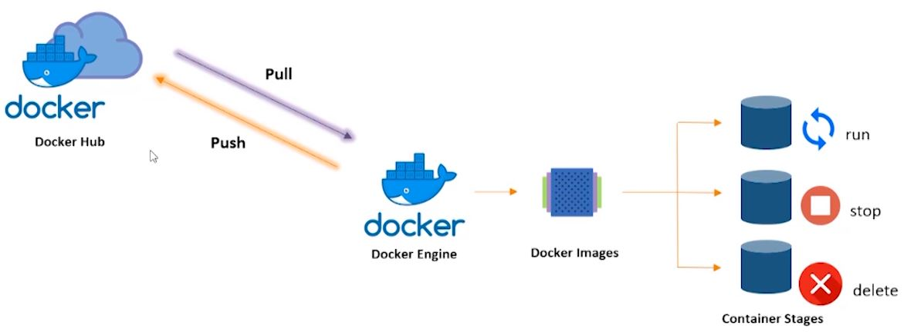
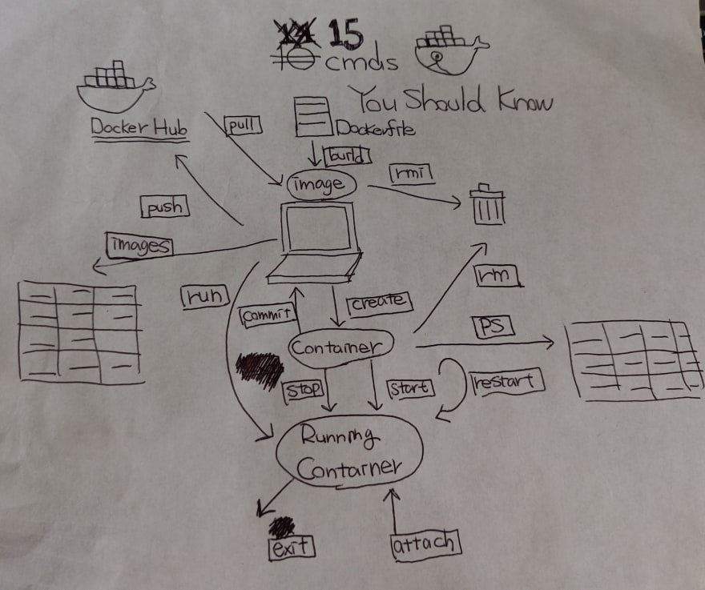

# Docker Notes

## docker container life cycle


## 15 usefeul docker commands


## Docker Notes
* docker image
	* packaged software like war, jar etc
	* Software we run with in a container
	* Image will be build in layers
	* We will have base image then we will add our software and create a new image
* container
	* Stripped to basic version of linux operating system. It is run time environment for our images
	* the movement we run the image with docker engine, It will become container
	* Instead of installing hypervisor and virtual machine and OS in virtual machine, we install one operating system. one top of one operating system, create n no.of containers. Each container is slice of operating system. Inside these containers we run our apps. One-to-one mapping. Means one app per container
* Dockerfile - Name should be same. No extensions
	* Dockerfile is a text document that contains all the commands a user could call on the command line to create an image
	* Using docker build user can create automated build that executes several command line instructions in sequence present in Dockerfile
	* Dockerfile present in root directory of project
	* Simple powershell or shell script to install software, build the image
```
docker build . -t [image-name]
```
* Docker volume
	* docker volume is used to persist the data across the life time of a container
	* Way to map host file system to container so any files accessed by container won't be lost even container went down
* Bind mount vs docker volume
	* `bind mount`: mount particual file location inside the container. For example we want to mount `dockerfile` folder in local system to `/app` directory in container then use this command `docker run -it -v C:/docker/dockerfile:/app -d image-name`
	* Files from `dockerfile` directory won't be copied into container but container directory will be mirrored. For Bind mount to work the container on which it is build and docker run should be same. Because we will have issue with path for example between linux and windows paths
	* docker volume
		* docker engine will automatically identifies where this volume has to exist. We don't need to specify the paths
* Whenever we want to push our image to docker hub account. Then docker image name should be
	* username/user-defined-image-name
* Start the container by running image
	* `-it` - Interactive terminal
	* `-p 9080:8080` - Does port mapping. 9080 == port number on the host system where container is running. 8080 == port number of application running in the container. We are mapping 8080 port of container to 9080 port on our system, so we can hit url with 9080
```
docker run -it -p 9080:8080 image-name
```
* Docker Hub
	* public docker registry, a place where we can strore and retrieve docker images
* Open container initiative (OCI)
	* responsible for standards around basic and fundamental components of a container eco system, the container format and the container run time
	* If every one starts writing their own standards for container like core OS, it will be difficult to maintain container technology. So OCI formed to maintain standards for containers
* Some tools build around container technology
	* Orchestration tools
	* Clustering tools
	* Management tools
	* Monitoring and logging tools
* can containers used for statefull apps or they only for stateless apps?
	* container can handle both. But containers excel in handling stateless
* Container registries
	* place where we store and retrieve images.
* Some container registries
	* Docker Hub by Docker Inc.
	* Quay by Core OS
	* Google Container registry by Google
	* Amazon EC2 container registry by Amazon
* Private registries to run with in corporate firewall
	* Docker trusted registry (DTR)
	* Quay Enterprise
* Flow of using containers
	* Write application -> push to SCM like github, bitbucket > Testing > Push to container registry which builds and creates updated container image > We can deploy image to any where like private cloud, AWS etc
	* All above steps can be automated
* On Premises docker products
	* Tools for build
		* Docker Engine
		* Docker Swarm
	* Tools for shipping
		* Docker trusted registry
	* Tools to run images
		* Docker universal control plane
* On cloud docker products
	* Tools for Build
		* Docker Engine
		* Docker Swarm - For docker clustering
		* Docker Content Trust - verifies the pusblisher and content of image
	* Tools for shipping images
		* Docker Hub
	* Tools to run images
		* Tutum - for deploying and managing apps in the cloud. Can be used to deploy app in AWS, Azure etc in multiple cloud platforms
* Container orchestration
	* Container apps spawning acorss multiple containers and hosts
	* Orchestration tool takes care of which containers should go into which hosts etc
* Docker Orchestration products
	* Docker machine
	* Docker compose - define and compose multi container apps
	* Docker swarm - scheduling container across estate of docker hosts
	* Docker Tutum - UI lets us control and manage everything
* Other orchestration products
	* Kubernetes by Google
	* Mesosphere Datacenter OS
	* CoreOS Fleet, etcd
	* Openstack Magnum
	* Cloudify

## Dockerfile notes
* Name should be always `Dockerfile`
* FROM
	* First line of dockerfile is always FROM
	* The FROM keyword is used to define the base image, on which we will be building
* ADD
	* The ADD keyword is used to add files to the container being built
	* ADD [source] [destination in container]
* RUN
	* The RUN command is used to add layers to the base image by installing component. Whenever we want to run any commands in the container
	* `-y` in the image will not prompt for yes/no while running command
```
RUN apt-get -y install apache2
```
* CMD
	* The CMD keyword is used to run commands on the start of the container. These commands run only when there is not argument specified while running the container
* ENTRYPOINT
	* Used to strictly run commands the moment the container initializes
	* The difference between CMD and ENTRYPOINT is, ENTRYPOINT will run irrespective whether argument is specified or not while running the container
* ENV
	* Is used to set environment variables in side the container
```
ENV [name-of-variable] [value-of-variable]
```

## Docker compose notes
* Want to deploy multiple containers then we use docker compose
* Docker compose is tool for defining and running multi-container Docker applications
* With Compose, we use YAML file to configure application services. Then with single command, we create and start all the services from YAML configuration
* composer starts and run entire app
```
docker-compose up -d
```
* Docker compose file name should be
	* docker-compose.yml (or) docker-compose.yaml
	
## Docker swarm notes
* Container Orchestration tool
* Used to monitor the health of the container. If any container goes down because of some reason,then docker swarm automatically repairs it by stopping the container and launching new container in the place of it. This automation is called container orchestration
* Docker swarm comes with package of docker
* Docker swarm is clustering and scheduling tool for Docker containers
* With docker swarm, we can establish and manage cluster of docker nodes as single virtual machine